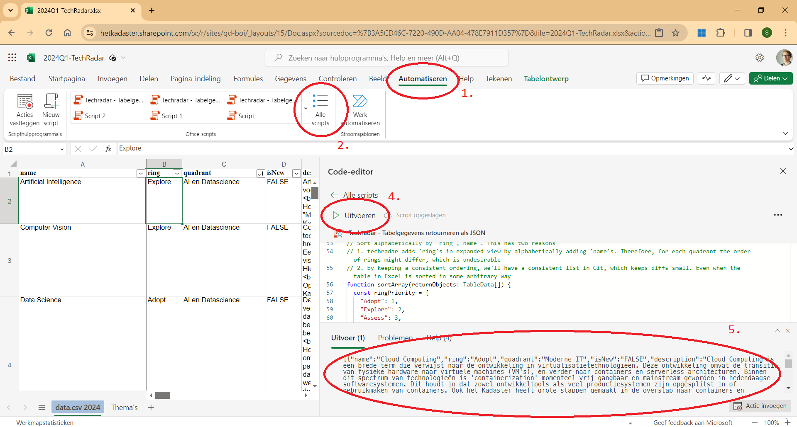

[](https://github.com/sheerun/prettier-standard)

A fork of ThoughtWork's [build-your-own-radar](https://github.com/thoughtworks/build-your-own-radar) project.

## Demo

This radar is compiled and hosted on GitHub Pages. The `content/data.json` is plugged in, which leads to [this visualization](https://kadaster-labs.github.io/tech-radar/?documentId=https%3A%2F%2Fraw.githubusercontent.com%2Fkadaster-labs%2Fbuild-your-own-radar%2Fmaster%2Fcontent%2Fdata.json). This visualization is embedded on https://labs.kadaster.nl/tech-radar/.

## How To Use

### Using JSON data

An example of a data file:

```json
[
  {
    "name": "Computer Vision",
    "ring": "Explore",
    "quadrant": "AI en Datascience",
    "isNew": "FALSE",
    "description": "Computer vision is een veld binnen AI ..."
  },
  {
    "name": "Generative AI",
    "ring": "Assess",
    "quadrant": "AI en Datascience",
    "isNew": "TRUE",
    "description": "Generatieve AI gaat over het genereren van ..."
  },
  {
    "name": "Event Stream Processing",
    "ring": "assess",
    "quadrant": "Moderne IT",
    "isNew": "FALSE",
    "description": "Data is steeds minder statisch en steeds meer ..."
  },
  {
    "name": "Self-Sovereign Identity",
    "ring": "Monitor",
    "quadrant": "Privacy- bescherming",
    "isNew": "FALSE",
    "description": "Self-sovereign identity (SSI) is een concept ..."
  }
]
```

We currently make use of the following quadrants. Please note this is subject to change:
- AI en Datascience
- Moderne IT
- Privacy- bescherming
- Federatieve Datadeling

> [!WARNING]
> Please note the dash in "Privacy- bescherming". While a bit unfortunate, it is required for the rendering of the radar, as it will otherwise wrap the word at strange places. This means that the dash should also be included in the Excel file. Otherwise, no blips will show up! This should be improved, either by decreasing font size, or perhaps hardcoding where to split the word.


### Excel to JSON
We compile the list of technologies in a separate [Excel document](https://hetkadaster.sharepoint.com/sites/gd-boi/b08af/Content/2020-013-TechRadar/2024Q1-TechRadar.xlsx?d=w3a5cd46c7220490daa04478e7911d357&csf=1&web=1&e=VVexwD). This allows for easy collaboration between team members. Previously, we made CSV export from this document, but it has some complications with newlines and delimiters as the company uses the Dutch language pack.

Another, more convenient, way to provide the data is using a JSON array.The linked Excel document contains a "Office Scripts" script which outputs the Content table as JSON and prints it to console. The script can be used to easily export the data from Excel to this repo.

The following steps can be taken to perform the export:
1. Go to "Automatiseren" in Excel, works for either web or desktop
2. Select "Alle scripts"
3. (not in picture) Locate the "Techradar - Tabelgegevens retouneren als JSON" scripts and choose "Bewerken". The script should be embedded and be accessible from the notebook. The code is added in `Tabelgegevens retourneren als JSON.ts` as reference, but should not be needed. In the "Bewerken" view, you should see the Code-editor.
4. Hit "Uitvoeren". The results should be shown in the newly shown Console at the bottom.
5. Copy the result from "Uitvoer" and paste in `content/data.json`. Please format the file with Alt+Shift+F to convert from single line to a better reading format.



We can enter the publicly accessible URL (not behind any authentication) of this JSON file into the tech radar, which will then be rendered. The JSON data file is hosted on GitHub, from within this repo.

### Building the radar

The develop this locally, we recommend Node 18. To install the dependencies:

```console
npm ci
```

In order to view the project in action, it needs to be built and served as web assets.

```console
# Build project
npm run build:prod

# Place data file in web server folder
mkdir -p dist/files && cp content/data.json "$_"

# Serve assets
npx serve dist/
```

The build artifacts can then be accessed in the browser at http://localhost:3000. This will show the default __empty radar__ state.

The __populated radar__ can be found at http://localhost:3000/?documentId=http%3A%2F%2Flocalhost%3A3000%2Ffiles%2Fdata.json.


### Hosting
We use GitHub Pages for hosting the compiled project. Every time a commit is made on the `main` branch, a GitHub Action workflow does the same steps as "Building the radar" and publishes the results as a GitHub Page.

The resulting visualization can be embedded on different websites. We use an iframe for this.

```html
<iframe class="tech-radar"
  src="https://kadaster-labs.github.io/tech-radar/?documentId=https%3A%2F%2Fraw.githubusercontent.com%2Fkadaster-labs%2Fbuild-your-own-radar%2Fmaster%2Fcontent%2Fdata.json"
  frameborder="0" height="1050px" width="100%">
</iframe>
```


### Contributing
For information on the e2e tests and usage of the Docker image, please consult the original build-your-own-radar repo.
